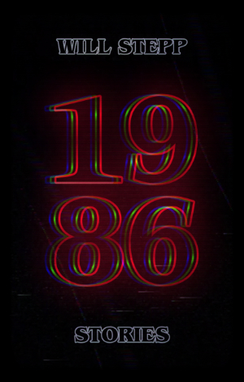

A collection of ten interconnected stories about a boy growing up in a small town in Georgia, set against the backdrop of the 1980s. From a secret pond nestled in the woods to the fog-shrouded rooftop of an interstate truck stop, to the shadowy corridors of a YMCA basement, familiar landscapes transform into realms of childhood wonder and discovery. Together, these dreamlike and often surreal tales weave a nostalgic meditation on family, home, memory, and time.

 

#### [“An absolutely haunting and emotionally charged reading experience.”](https://www.kirkusreviews.com/book-reviews/will-stepp/1986-stories/)
#### *—Kirkus Reviews*  

 

#### ["Atmospheric & real—a recollective mood on childhood, family, and friends in the 1980s, coated with the nostalgia of times gone by. 'New Knife' might be the best short story I've read in years."](https://independentbookreview.com/2024/11/01/book-review-1986-by-will-stepp/)
#### *—Toni Woodruff, Independent Book Review*  

 

#### ["This book engrossed me in ways I struggle to explain as Will Stepp perfectly captures the ineffable qualities of reminiscing. While people tend to present their life stories as cohesive narratives with clear structure, themes, and resolution, things are rarely so simple: we misremember things, omit details that don't neatly fit into the narrative, and filter past events through our current perspectives and biases. The book embraces this messiness and keeps us immersed in the main character's raw experiences through vivid descriptions, bursts of streams of consciousness, and hazy, dreamlike scenes open to interpretation."](https://readersfavorite.com/book-review/1986)
#### *—Gabriel Santos, Readers' Favorite*

 

#### [Buy at Amazon](https://www.amazon.com/1986-Stories-Will-Stepp/dp/B0DJGBL22Y)
#### [Buy at Barnes & Noble](https://www.barnesandnoble.com/w/1986-will-stepp/1146381386)
#### [Buy at Walmart](https://www.walmart.com/ip/1986-Stories-Paperback-9798991503600/12989019729)